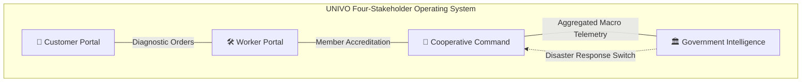
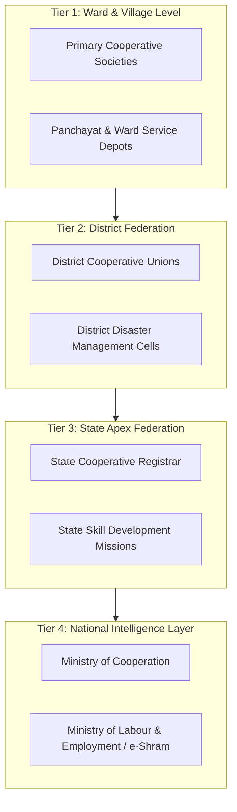
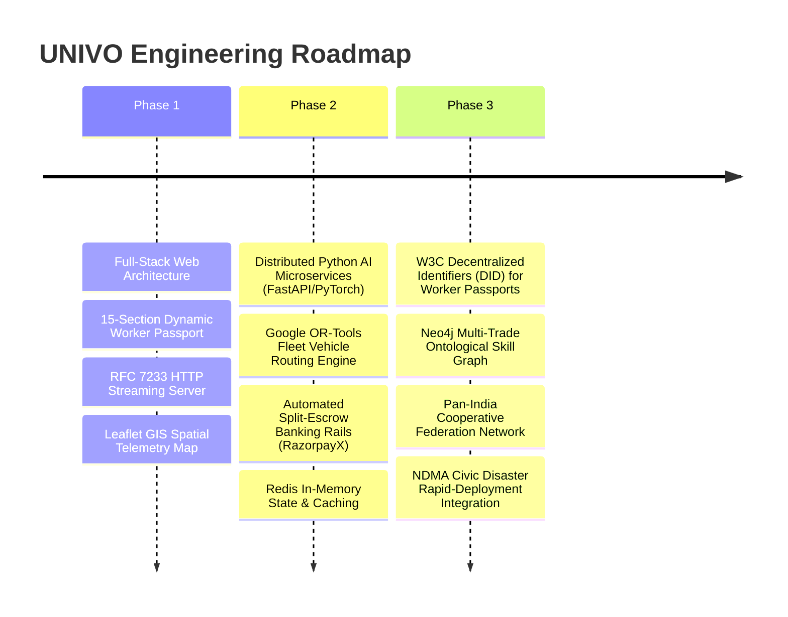

# UNIVO — Cooperative Gig Operating System

> *Every job creates intelligence for the next opportunity.*

[](https://nodejs.org/)
[](https://supabase.com/)
[](https://leafletjs.com/)
[](https://httpwg.org/specs/rfc7233.html)
[](LICENSE)

UNIVO is not a conventional two-sided service marketplace. It is a **cooperative workforce operating system** connecting service discovery, technical skill qualification, algorithmic fairness, occupational health protection, split payments, learning, and public workforce intelligence into a unified computational architecture.

By coordinating four primary stakeholders—**Customers, Service Workers, Cooperative Societies, and Government Administrators**—UNIVO transforms ephemeral gig transactions into durable human capital, verifiable craftsmanship, and systemic economic resilience.

---

## The Structural Problem

Modern informal labor markets and commercial aggregator platforms are optimized for short-term transaction extraction at the expense of workforce sustainability:

* **Informal & Fragmented Workforce:** Millions of skilled and semi-skilled trade workers operate without formal credentialing, institutional representation, or collective bargaining power.
* **Asymmetric Skill Verification:** Customers rely on unverified claims, while skilled artisans have no standardized mechanism to prove mastery over specialized tools, safety codes, or complex diagnostics.
* **Static, Fragile Reputations:** Worker identity is flattened into a 1-to-5 star rating vulnerable to customer bias and retaliation. A worker deactivated or switching apps loses their entire professional track record overnight.
* **Reactive Job Discovery:** Technicians wait idly for random algorithmic pings rather than having systematic visibility into upcoming neighborhood maintenance cycles.
* **Opportunity Concentration via Black-Box Dispatch:** Winner-take-all algorithms funnel dispatches to a tiny fraction of hyper-active workers, stranding equally competent peers in underemployment.
* **Burnout by Design:** Commercial surge pricing actively incentivizes dangerous 12–16 hour shifts, penalizing workers who take rest or fall sick.
* **Isolated Cooperative Societies:** Grassroots labor unions and credit societies lack modern software infrastructure to coordinate dispatches, monitor member welfare, or forecast trade deficits.
* **Policy Blindness:** Municipalities and state agencies remain blind to localized trade shortages, wage degradation, and workforce migration patterns until acute labor distress emerges.

> **The problem is not simply finding a worker.**  
> **The problem is coordinating an entire workforce fairly, intelligently, and sustainably.**

---

## The UNIVO Idea

UNIVO replaces transactional extraction with a closed-loop workforce operating model.

```text
TRADITIONAL TRANSACTIONAL MODEL:
Customer Problem ──► Matching Ping ──► Extraction Fee ──► Ephemeral Termination

UNIVO CLOSED-LOOP OPERATING SYSTEM:
Customer Problem
  │
  ▼
AI Job Understanding (Semantic Symptom Extraction)
  │
  ▼
Qualification Gate (15-Dimensional Skill DNA Verification)
  │
  ▼
Fair Dispatch Engine (Multi-Objective Equity Optimization)
  │
  ▼
Autonomous Worker Decision (Unpenalized Dignity Control)
  │
  ▼
Standardized Service Delivery
  │
  ▼
Split Escrow Settlement (Direct Payout + Cooperative Mutual Aid Reserve)
  │
  ▼
Collective Intelligence Feedback (Skill DNA Evolution, Fatigue Throttling, Demand Update)
```

### Core Philosophies

* **A worker is more than a rating.** Craftsmanship is multi-dimensional—spanning specialized tools, diagnostic accuracy, safety protocols, and certified trade experience.
* **A job is more than a transaction.** Every service task completed contains structural data about equipment lifecycles, neighborhood demand density, and skill requirements.
* **Fairness belongs inside allocation.** Opportunity distribution should proactively balance guild livelihood, idle time, and geographical dignity alongside customer speed.
* **AI recommends; humans remain in control.** Dispatch algorithms must be transparent, auditable, and unpenalized. Workers preserve the absolute right to refuse orders.
* **Cooperative data becomes collective intelligence.** Reinvesting operational telemetry into local cooperative societies creates long-term institutional capital for labor.

---

## Why UNIVO is Different

**Traditional platforms primarily optimize individual transactions.  
UNIVO connects transactions to collective workforce intelligence.**

| Dimension | Traditional Gig Marketplace | UNIVO Cooperative Gig OS |
| :--- | :--- | :--- |
| **Worker Identity** | Disposable account; owned and monetized by the platform | Sovereign, accredited Worker Passport owned by the worker |
| **Skill Representation** | Generic trade tags + 1–5 star subjective review average | 15-dimensional dynamic Skill DNA (tools, complexity, certifications) |
| **Matching Mechanics** | Distance-only heuristic or lowest-bidder auction | Qualification-first gatekeeper paired with cooperative proximity |
| **Dispatch Logic** | Opaque ranking favoring extreme platform availability | FairWork AI: balances skill fit, idle rotation, and income parity |
| **Worker Control** | Penalties for declining jobs; hidden shadow-bans | Full autonomy; explainable job parameters; zero retaliation |
| **Trust Intelligence** | Superficial star ratings vulnerable to customer bias | Multi-factor trust: certified tool audits, safety records, guild backing |
| **Wellbeing & Safety** | Incentivizes exhaustion via dynamic surge multipliers | Wellbeing Guardian: tracks shift hours and throttles dispatches |
| **Demand Visibility** | Concealed behind dynamic surge pricing | Demand Radar: forecasts upcoming localized work before it occurs |
| **Cooperative Role** | Bypassed; cooperatives viewed as market friction | Core administrative layer: handles vetting, welfare, and representation |
| **Decision Simulation** | Proprietary corporate modeling focused on take-rates | Digital Twin: co-ops simulate wage, capacity, and coverage changes |
| **Welfare & Mutual Aid** | Out-of-pocket or completely absent | Integrated Mutual Aid Fund funded by platform transaction splits |
| **Crisis Coordination** | Opportunistic price surge during disasters | GigForce Crisis Mode: pivots trade fleets into civic recovery brigades |
| **Governance** | Unilateral corporate terms-of-service updates | Democratic member voting and assembly resolution tracking |
| **Government View** | Blocked by commercial confidentiality | Authorized, anonymized macro labor telemetry for public policy |

---

## What We Built

UNIVO provides dedicated, purpose-built interfaces for all four ecosystem stakeholders:



### 1. Customer Portal
* **Multimodal Service Ingestion:** Describe problems via natural language text, vernacular voice audio, or photographic evidence.
* **AI-Assisted Job Diagnostics:** Diagnostic engine resolves customer symptoms into standardized trade scopes, required toolkits, and baseline price brackets.
* **Qualified Matching & Transparency:** Insight into why a specific cooperative technician was recommended, detailing verified trade badges and guild accreditation.
* **Lifecycle Tracking & Invoicing:** Real-time job milestone updates, digital receipts, transparent labor breakdowns, and verified feedback logging.

### 2. Worker Portal
* **15-Section Dynamic Worker Passport:** Comprehensive digital credential capturing identity records, verified professions, secondary trades, specialized toolkits, certifications, languages, rate matrices, and emergency contacts.
* **Skill DNA Engine:** Tracks technical versatility, equipment certifications, and task complexity records over time.
* **Fair Dispatch Feed:** Job opportunities dispatched with clear explanations regarding distance, required skill match, and estimated remuneration.
* **Trust Score & Guild Attestation:** Visual breakdown of trade accreditations, cooperative society endorsements, and punctuality indices.
* **Operational Calendar & Availability:** Self-managed working hours, calendar sync, and active/rest toggles.
* **Earnings & Welfare Analytics:** Transparent breakdowns of take-home pay, cooperative fee allocations, and accumulated welfare credits.
* **Wellbeing Guardian Indicator:** Tracks consecutive shift intensity and transit fatigue, proactively advising rest.

### 3. Cooperative Command Dashboard
* **Workforce Overview & Rostering:** Live telemetry of registered guild artisans, active dispatches, and regional trade distribution across municipal wards.
* **Fairness Center:** Real-time algorithmic oversight monitoring Gini coefficients of opportunity distribution, dispatch dispersion rates, and equity rebalancing across members.
* **Wellbeing & Safety Intelligence:** Fleet-wide fatigue monitoring, overwork alerts, and hazardous job tracking.
* **Welfare & Mutual Aid Hub:** Administration of member medical claims, micro-grants, emergency stipends, and retirement allocations.
* **Skill-Gap Analytics & Training Planner:** Identifies trades experiencing unmet regional demand, enabling coordinators to schedule upskilling workshops.
* **Democratic Governance:** Member voting portals to table resolutions, vote on bylaws, and elect coordinators.
* **Digital Twin / What-If Engine:** Simulation sandbox allowing coordinators to model the systemic impact of wage floor adjustments, capacity expansion, or weather disruptions before issuing operational policies.

### 4. Government Intelligence
* **Authorized Macro Aggregation:** Strictly decoupled from Personal Identifiable Information (PII); provides state and municipal bodies with macro labor telemetry.
* **Interactive GIS Spatial Map:** Real-time district-level visualization of cooperative coverage, labor density, and underserved zones built on Leaflet.js.
* **Demand & Supply Forecasting:** Macro-level identification of seasonal labor shortages and infrastructure maintenance demands.
* **Skill Gap & Training Intelligence:** Informs public vocational institutions (e.g., ITI, NSDC) on localized trade deficits to optimize state training subsidies.
* **GigForce Crisis Deployment:** Municipal command interface to mobilize certified cooperative plumbers, electricians, and technicians for rapid civil recovery during floods, cyclones, or civic infrastructure failures.

---

## Signature Innovations

### FairWork AI / Fair Dispatch
* **What it does:** Allocates service requests using a multi-objective optimization function balancing skill qualification, geographic dignity, idle rotation, and income parity across the guild.
* **Problem:** Commercial algorithms concentrate jobs among hyper-active workers to shave seconds off arrival times, accelerating burnout while leaving equally qualified peers underemployed.
* **Why it matters:** Ensures every verified cooperative worker receives a fair distribution of livelihood opportunities while eliminating arbitrary algorithmic penalties.

### Worker-Controlled AI
* **What it does:** Provides workers transparent visibility into why an opportunity was matched to them, allowing them to define personalized dispatch preferences, maximum travel radiuses, and preferred tool scopes.
* **Problem:** Commercial gig workers are managed by black-box algorithms that punish rejected orders with hidden shadow-bans or demotions.
* **Why it matters:** Restores human autonomy and self-determination to digital labor management.

### Skill DNA
* **What it does:** Structures worker capability across 15 distinct dimensions—including tool ownership, certified task complexities, language fluencies, and historical diagnostic accuracy—into a verifiable digital credential.
* **Problem:** Workers are flattened into generic categories and subjective 5-star ratings, making specialized craftsmanship invisible.
* **Why it matters:** Transforms labor into an appreciating asset, allowing workers to build cumulative, portable professional equity.

### Trust Intelligence
* **What it does:** Computes a multidimensional trust rating incorporating physical tool verification, cooperative society attestation, safety adherence, and craft execution.
* **Problem:** Subjective review systems are vulnerable to customer bias, extortion, and discrimination.
* **Why it matters:** Grounds trust in verifiable trade competence, backed by the peer accountability of the cooperative society.

### Wellbeing Guardian
* **What it does:** Monitors consecutive working hours, extreme transit distances, and strenuous environmental conditions, automatically throttling dispatch access and initiating rest prompts when fatigue thresholds are met.
* **Problem:** Platforms profit from overwork, encouraging 12–16 hour shifts that lead to chronic illness and workplace accidents.
* **Why it matters:** Embeds occupational health and life preservation directly into the dispatch engine.

### Demand Radar (Jobs Before They Arrive)
* **What it does:** Analyzes seasonal weather patterns, historical equipment degradation cycles, and municipal housing age to forecast specific maintenance needs before customers file a ticket.
* **Problem:** Informal workers endure extreme income volatility because they react purely to ad-hoc breakdowns.
* **Why it matters:** Converts volatile break-fix gig work into predictable, scheduled preventative maintenance contracts.

### Cooperative Brain
* **What it does:** Aggregates telemetry across hundreds of local dispatches to provide cooperative leaders with unified insights into guild earnings, dispute trends, and tooling bottlenecks.
* **Problem:** Small cooperatives cannot compete against tech monopolies due to lack of software infrastructure and data science resources.
* **Why it matters:** Gives grassroots worker collectives institutional-grade computational intelligence.

### Digital Twin / What-If Simulator
* **What it does:** An in-browser predictive simulation environment allowing cooperative managers to simulate the systemic consequences of adjusting base rates, admitting new apprentice cohorts, or expanding service boundaries.
* **Problem:** Operational mistakes in price setting or labor supply directly hurt low-income workers before they can be corrected.
* **Why it matters:** Enables safe, risk-free policy experimentation before rolling out changes to the living workforce.

### GigForce Crisis Mode
* **What it does:** A coordinated civic failover switch that pivots trade professionals (certified pipefitters, high-voltage wiremen, structural carpenters) into emergency disaster response units during municipal crises.
* **Problem:** During natural disasters, corporate platforms either shut down or engage in opportunistic surge pricing while cities struggle to find skilled repair crews.
* **Why it matters:** Turns the everyday cooperative workforce into an organized national civil defense asset.

---

## AI Diagnostic Pipeline

The UNIVO diagnostic layer acts as an automated triage mechanism that translates uncalibrated customer descriptions into structured, actionable engineering work orders.

```text
Customer Input (Text / Vernacular Voice / Photo)
  │
  ▼
[Input Ingestion & Tokenization]
  │  Multi-field parsing, noise filtration, and symptom extraction
  ▼
[Domain Taxonomy Classifier]
  │  Keyword & semantic mapping across 18 standardized service domains
  ▼
[Parameter Extractor]
  ├── Problem Identification: Classifies core failure (e.g., fluid pressure drop vs. short circuit)
  ├── Urgency Calibration: Distinguishes preventative maintenance from emergency hazards
  ├── Spatial Locality: Determines municipal ward, district, and nearest cooperative hub
  └── Requisite Tools & Gear: Infers necessary physical equipment and safety ratings
  │
  ▼
[Qualification Gatekeeper Query]
  │  Queries Worker Passports; filters only candidates with matching Skill DNA & tools
  ▼
[FairWork Allocation Matrix]
  │  Evaluates qualified candidates across distance, idle time, and income parity
  ▼
[Explainable Recommendation Payload]
  │  Generates transparent matching rationale delivered to both customer and worker
  ▼
[Human Decision & Service Execution]
  │  Worker accepts autonomously; customer reviews diagnostic scope
  ▼
[Post-Execution Intelligence Feedback]
     Logs actual vs. predicted complexity, updating diagnostic model weights
```

---

## Fair Dispatch Technical Deep Dive

Commercial dispatch algorithms treat labor allocation as a latency-minimization or margin-maximization problem. UNIVO treats dispatch as an **ethical multi-objective resource allocation problem**.

> **Foundational Principle:**  
> *Qualification comes first. Fairness operates exclusively among qualified candidates.*

```text
Incoming Work Order
        │
        ▼
╔══════════════════════════════════════════════════════╗
║              STAGE 1: THE QUALIFICATION GATE         ║
║  - Does the worker hold the certified trade skill?    ║
║  - Does the worker possess verified required tools?   ║
║  - Does the worker hold necessary safety credentials?║
╚══════════════════════════════════════════════════════╝
        │
        ├── Worker Unqualified ──► [DISQUALIFIED FROM ALLOCATION]
        │
        ▼
   Qualified Cohort
        │
        ▼
╔══════════════════════════════════════════════════════╗
║              STAGE 2: FAIRNESS EVALUATION            ║
║  - Skill Match Alignment (Depth in specific task)    ║
║  - Availability & Schedule Status                    ║
║  - Geographic Dignity (Minimizing unpaid transit)    ║
║  - Historical Reliability & Safety Execution         ║
║  - Workload & Fatigue Index (Wellbeing Check)         ║
║  - Opportunity Equity (Gini-balancing income spread) ║
╚══════════════════════════════════════════════════════╝
        │
        ▼
╔══════════════════════════════════════════════════════╗
║              STAGE 3: DISPATCH & EXPLAINABILITY      ║
║  - Multi-attribute score ranking                     ║
║  - Generation of human-readable matching explanation  ║
║  - Autonomous worker review without penalty timers   ║
║  - Immutable audit logging for cooperative oversight ║
╚══════════════════════════════════════════════════════╝
```

### The 12-Step Fair Dispatch Engine

1. **Qualification Gate:** Strict binary filter checking trade certifications, validated tools, and safety accreditations.
2. **Skill Fit:** Assesses specific proficiency depth against task complexity (e.g., 3-phase industrial wiring vs. domestic socket repair).
3. **Availability State:** Checks active shift toggles, personal calendar reservations, and non-working days.
4. **Geographic Dignity:** Calculates realistic route distances to ensure workers are not subjected to exhausting, unpaid commutes.
5. **Reliability Index:** Evaluates historical on-time arrival, milestone completion rate, and verified craft execution.
6. **Workload Analysis:** Assesses tasks completed within the current 24-hour cycle to prevent fatigue accumulation.
7. **Opportunity Balance:** Measures aggregate earnings across the cooperative guild; prioritizes qualified workers who have experienced idle periods.
8. **Composite Ranking:** Generates an allocation matrix balancing customer proximity with guild economic equity.
9. **Explainability Generation:** Computes a transparent match explanation detailing why this worker received the assignment.
10. **Human Control:** The worker exercises total autonomy to accept or reject the dispatch without algorithmic shadow-banning.
11. **Audit Logging:** Dispatches, rationale vectors, and outcomes are permanently logged for cooperative supervisory review.
12. **Continuous Learning:** Diagnostic accuracy and customer satisfaction feedback adjust future qualification weights.

---

## The Collective Intelligence Loop & Data Flywheel

In UNIVO, no service task exists in isolation. Every completed job enriches the broader ecosystem:

```text
                     ┌────────────────────────────────────────┐
                     │          ONE COMPLETED TASK            │
                     └───────────────────┬────────────────────┘
                                         │
     ┌───────────────────┬───────────────┴───────────────┬───────────────────┐
     ▼                   ▼                               ▼                   ▼
[DEMAND RADAR]   [SKILL DNA UPDATE]              [WELLBEING AUDIT]   [COOPERATIVE HEALTH]
Records plumbing  Appends verified tool complexity  Logs shift hours;   Allocates 3% to
failure density   and pipe-joint diagnostic to      calibrates worker   mutual aid fund;
for neighborhood  worker's portable passport        fatigue index       updates guild revenue
     │                   │                               │                   │
     └───────────────────┼───────────────────────────────┼───────────────────┘
                         ▼                               ▼
               [COLLECTIVE INTELLIGENCE] ──► [BETTER DISPATCH DECISIONS]
```

$$\mathbf{Job} \longrightarrow \mathbf{Data} \longrightarrow \mathbf{Intelligence} \longrightarrow \mathbf{Decision} \longrightarrow \mathbf{Outcome} \longrightarrow \mathbf{More\ Data}$$

---

## Technical Architecture: Implemented vs. Planned Stack

```text
┌────────────────────────────────────────────────────────────────────────┐
│                          IMPLEMENTED STACK                             │
│                  (Verified in Repository Codebase)                     │
├───────────────────┬────────────────────────────────────────────────────┤
│ Frontend Layer    │ Vanilla ES6+ Web Standards, Custom CSS3 Tokens,    │
│                   │ Google Fonts (Fraunces, Space Mono, Instrument),   │
│                   │ Leaflet.js v1.9.4 GIS Mapping Client               │
├───────────────────┼────────────────────────────────────────────────────┤
│ Application /     │ Custom Node.js HTTP Server (`server.js`),          │
│ Streaming Backend │ RFC 7233 Byte-Range Streaming (`206 Partial Content│
│                   │ Dual-Root Route Resolution, Zero NPM Dependencies  │
├───────────────────┼────────────────────────────────────────────────────┤
│ Database &        │ PostgreSQL via Supabase, Relational Schemas,       │
│ Data Layer        │ JSONB Polymorphic Documents, Row-Level Security,   │
│                   │ Automated Timestamp Triggers, Composite Indexing   │
├───────────────────┼────────────────────────────────────────────────────┤
│ Diagnostic AI     │ In-Browser Rule-Based NLP & Keyword Taxonomy       │
│ Engine            │ Diagnostic Engine (`ai-recommend.html`)            │
└───────────────────┴────────────────────────────────────────────────────┘

┌────────────────────────────────────────────────────────────────────────┐
│                     PLANNED / TARGET ARCHITECTURE                      │
│                  (Documented Enterprise Blueprint)                     │
├───────────────────┬────────────────────────────────────────────────────┤
│ Frontend Next-Gen │ React.js, Tailwind CSS, Web Workers                │
├───────────────────┼────────────────────────────────────────────────────┤
│ Microservices     │ FastAPI (Python), Express.js (Node.js),            │
│ Backend           │ BullMQ Async Task Queue, Redis In-Memory Cache     │
├───────────────────┼────────────────────────────────────────────────────┤
│ Advanced ML &     │ PyTorch, Hugging Face Transformers (IndicBERT),    │
│ Computer Vision   │ OpenCV, Whisper / IndicConformer Speech Models     │
├───────────────────┼────────────────────────────────────────────────────┤
│ Combinatorial     │ Google OR-Tools (Vehicle Routing Problem solver),  │
│ Optimization      │ SciPy, NumPy Spatial Optimization                  │
├───────────────────┼────────────────────────────────────────────────────┤
│ Knowledge & Graph │ Neo4j Graph DB (Worker-Tool-Task Knowledge Graph), │
│                   │ pgvector Vector Store / RAG Manual Retrieval       │
├───────────────────┼────────────────────────────────────────────────────┤
│ Geospatial Fleet  │ PostGIS Geospatial Engine, OpenStreetMap,          │
│                   │ OSRM / GraphHopper Self-Hosted Routing Clusters    │
├───────────────────┼────────────────────────────────────────────────────┤
│ Financial Rails   │ Automated Split-Escrow Banking API                 │
│                   │ (RazorpayX / Stripe Connect)                       │
├───────────────────┼────────────────────────────────────────────────────┤
│ Containerization  │ Docker Multi-Stage Builds, Kubernetes Orchestration│
└───────────────────┴────────────────────────────────────────────────────┘
```

---

## Security, Privacy & Data Governance

UNIVO enforces strict **data minimization** and **role-based boundaries**:

```text
┌───────────────────────────────────────────────────────────────────────┐
│                      DATA ACCESS GOVERNANCE                           │
├───────────────┬───────────────────────────────────────────────────────┤
│ Customer      │ Owns personal profile, service request history, and   │
│ Data Boundary │ private location coordinates. Can never inspect       │
│               │ individual worker home addresses or health telemetry. │
├───────────────┼───────────────────────────────────────────────────────┤
│ Worker        │ Owns the sovereign 15-Section Worker Passport, banking│
│ Data Boundary │ credentials, and Skill DNA. Explicitly grants read    │
│               │ access of trade credentials to verified cooperatives. │
├───────────────┼───────────────────────────────────────────────────────┤
│ Cooperative   │ Accesses authorized registry data for affiliated      │
│ Data Boundary │ guild members, dispatch performance, and mutual aid   │
│               │ claims. Isolated from peer cooperative jurisdictions. │
├───────────────┼───────────────────────────────────────────────────────┤
│ Government    │ Strictly decoupled from PII. Ingests mathematical     │
│ Data Boundary │ aggregates (district densities, median guild revenues,│
│               │ macro skill deficits) preventing state surveillance.  │
└───────────────┴───────────────────────────────────────────────────────┘
```

* **Row-Level Security (RLS):** All Supabase database tables (`cooperatives`, `cooperative_passport_requests`, `worker_passports`, `user_profiles`) enforce RLS policies restricting unauthorized reads and cross-tenant mutations.
* **Authentication & Role-Based Access Control (RBAC):** Distinct authentication flows segregating customer sessions, verified worker credentials, and cooperative administrative privileges.
* **Cryptographic Data Integrity:** Automated triggers (`tr_cooperatives_updated_at`) ensure tamper-resistant chronological audit logging across all state transitions.
* **Privacy by Aggregation:** Municipal and government intelligence feeds ingest strictly k-anonymized and aggregated metrics, preventing de-anonymization of worker activity.

---

## India-Specific Systemic Design & Scalability

UNIVO is engineered specifically for the socio-economic and institutional realities of the Indian subcontinent:



* **Vernacular & Multilingual Ingestion:** Designed for localized language accessibility across Indian trade clusters (Tamil, Hindi, Telugu, Kannada, Bengali).
* **Low-Bandwidth Resilient Delivery:** The application compiles to zero-bundle web technologies that execute rapidly over constrained mobile networks in semi-urban and rural taluks.
* **Alignment with Cooperative Acts:** Data models map directly to state Cooperative Societies Acts and the Multi-State Co-operative Societies Act, enabling legally recognized worker guilds to act as platform co-owners.
* **Civic Disaster Resilience:** Direct integration with municipal emergency protocols. Certified cooperative technicians are mobilized into organized civic repair corps during floods, cyclones, or urban infrastructure failures.

---

## Service Ecosystem (18 Standardized Families)

UNIVO classifies regional labor into **18 standardized service families**:

1. **Electrical:** Diagnostics, domestic wiring, sub-station maintenance, inverter systems, appliance safety audits.
2. **Plumbing & Water:** Pressure leak detection, pipeline fitting, sanitary drainage, solar water heaters, motor pump repair.
3. **Carpentry & Furniture:** Architectural woodwork, joinery, structural cabinetry, lock hardware, furniture restoration.
4. **Appliance & Cooling:** HVAC systems, commercial refrigeration, washing machines, compressor servicing, gas charging.
5. **Construction & Masonry:** Bricklaying, plastering, concrete casting, waterproofing, tile laying, structural patching.
6. **Painting & Finishing:** Surface preparation, exterior weatherproofing, wood staining, industrial protective coating.
7. **Gardening & Green Work:** Landscaping, drip-irrigation maintenance, terrace gardens, organic pruning.
8. **Cleaning & Sanitation:** Industrial deep cleaning, chemical tank sanitation, floor polishing, post-construction scrubbing.
9. **Pest & Hygiene:** Non-toxic integrated pest management, termite containment, biological sanitization.
10. **Care & Assistance:** Elder mobility companionship, post-operative home assistance, certified palliative support.
11. **Vehicle Services:** Mobile mechanical triage, electrical battery recovery, tyre puncture vulcanization, two-wheeler repair.
12. **Local Logistics:** Eco-friendly cargo delivery, intra-city moving, tool transportation, cooperative depot fulfillment.
13. **Household Assistance:** Domestic chore support, festive cooking coordination, household organization.
14. **Rural & Agriculture:** Agro-machinery servicing, harvester pump repairs, grain silo maintenance, micro-irrigation layout.
15. **Renewable & Green Jobs:** Rooftop solar PV installation, inverter battery recycling, domestic rainwater harvesting.
16. **Digital & Local Tech:** SOHO networking, CCTV installation, point-of-sale setup, biometric terminal triage.
17. **Safety & Security:** Fire extinguisher inspections, perimeter sensor fitting, structural safety auditing.
18. **General Local Services:** Metal welding, canvas awning fabrication, sheet metal repair, neighborhood utility support.

---

## Implementation Reality Matrix

| Module / System Component | Status | Empirical Repository Evidence |
| :--- | :---: | :--- |
| **HTTP Streaming Server** | ✅ Implemented | `server.js` running on Node.js with RFC 7233 HTTP Range 206 support. |
| **Relational Database Schemas** | ✅ Implemented | `schema_cooperatives.sql`, `schema_worker_passports.sql`, `schema_user_profiles.sql`. |
| **15-Section Dynamic Worker Passport** | ✅ Implemented | Complete interactive frontend in `worker-passport.html` with JSONB schemas. |
| **Government GIS Telemetry Map** | ✅ Implemented | Leaflet.js map client integrated into `government-dashboard.html`. |
| **AI Diagnostic & Recommendation** | ✅ Implemented | Working symptom NLP taxonomy engine in `ai-recommend.html`. |
| **Customer Portal & Bookings** | ✅ Implemented | Working authentication, UI, and booking states in `dashboard.html` & `login.html`. |
| **Worker Dashboard & Operations** | ✅ Implemented | Earnings tracking, dispatch feeds, and calendar controls in `worker-dashboard.html`. |
| **Cooperative Command Dashboard** | ✅ Implemented | Roster management, dispatch audits, and society metrics in `cooperative-dashboard.html`. |
| **Cooperative Digital Twin Simulator** | 🧪 Prototype | Interactive parameter sliders and heuristic forecasting UI in `cooperative-digital-twin.html`. |
| **Cooperative Fairness Center** | 🧪 Prototype | Visual Gini coefficient and opportunity dispersion monitors in `cooperative-fairness-center.html`. |
| **Democratic Assembly Voting** | 🧪 Prototype | Resolution tabling, member voting, and ballot UI in `worker-governance.html`. |
| **Welfare & Mutual Aid Hub** | 🧪 Prototype | Medical relief claims and emergency grant management in `worker-welfare.html`. |
| **Multimodal Voice & Vision Ingestion** | 🔬 Simulated | Client-side recording and photo upload interfaces with heuristic fallback processing. |
| **Predictive Demand Radar** | 🔬 Simulated | Deterministic seasonal time-series projection models in dashboard scripts. |
| **Python ML Microservices Pipeline** | 🗺️ Planned | Documented architectural target for FastAPI / PyTorch / Hugging Face clusters. |
| **Neo4j Ontological Skill Graph** | 🗺️ Planned | Documented architectural target for complex task-tool relational graph queries. |
| **W3C Decentralized Identifiers (DID)** | 🗺️ Planned | Documented architectural target for cross-platform cryptographic worker credentials. |

---

## Repository Structure

```text
prototype 3/
├── README.md                                # Master project documentation & architectural manual
├── index.html                               # Root gateway & automatic redirector to UNIVO platform
├── package.json                             # Node.js project manifest with start/dev scripts
├── run.bat                                  # One-click Windows batch launcher (starts server + opens browser)
├── server.js                                # Production HTTP streaming server supporting RFC 7233 range requests
└── reference/                               # UNIVO core application suites & asset repositories
    ├── index.html                           # Internal gateway redirector
    ├── ref.html                             # UNIVO master landing page & ecosystem gateway
    │
    ├── ai-recommend.html                    # AI Diagnostic Triage & Verified Worker Recommender
    │
    ├── login.html                           # Customer authentication portal
    ├── register.html                        # Customer registration portal
    ├── dashboard.html                       # Customer service management dashboard
    │
    ├── worker-login.html                    # Worker authentication portal
    ├── worker-register.html                 # Worker onboarding portal
    ├── worker-passport.html                 # 15-Section Dynamic Worker Passport engine
    ├── worker-dashboard.html                # Worker dispatch feed, earnings, and availability calendar
    ├── worker-governance.html               # Worker cooperative democratic voting & resolution portal
    ├── worker-welfare.html                  # Worker mutual aid, medical claims, and welfare hub
    │
    ├── cooperative-login.html               # Cooperative society authentication portal
    ├── cooperative-register.html            # Cooperative society onboarding portal
    ├── cooperative-dashboard.html           # Cooperative command overview & workforce roster
    ├── cooperative-digital-twin.html        # Cooperative Digital Twin / What-If Scenario Simulator
    ├── cooperative-fairness-center.html     # Algorithmic fairness & dispatch equity monitoring center
    ├── cooperative-welfare-hub.html         # Cooperative mutual aid fund & claims administration
    ├── cooperative-wellbeing.html           # Fleet occupational health & fatigue monitoring
    │
    ├── government-login.html                # Government administrative login
    ├── government-register.html             # Government agency registration
    ├── government-dashboard.html            # National & State Workforce Intelligence GIS Portal (Leaflet)
    │
    ├── schema_cooperatives.sql              # PostgreSQL schema: Cooperatives & passport approval requests
    ├── schema_worker_passports.sql          # PostgreSQL schema: 15-section JSONB Worker Passports
    ├── schema_user_profiles.sql             # PostgreSQL schema: Customer identities and preferences
    │
    ├── casadisolare.mp4                     # High-resolution architectural video asset
    ├── casadisolare.webp                    # Optimized web image preview
    ├── Customer_scrolling_on_phone_...mp4   # Customer interaction video asset
    ├── Worker_performing_repair_task_...mp4 # Technician repair execution video asset
    ├── Government_office_building_...mp4    # Public administration video asset
    ├── cooperative-portal.png               # Cooperative portal interface asset
    ├── download.png                         # Cooperative coordinators working together asset
    ├── preview_quarter.jpg                  # Editorial thumbnail preview asset
    ├── window.png                           # Cutout design system mask asset
    └── design_reference.txt                 # Typography, palette, and transition design tokens
```

---

## Local Setup & Quickstart

The project contains a complete, operational local runtime that serves all stakeholder portals, database schemas, and high-resolution streaming media with zero external build tooling.

### Prerequisites
* **Node.js**: `v18.0.0` or higher
* **Web Browser**: Chrome, Edge, Firefox, or Safari

### 1. Booting the Application Server
Run the local server from the project root:

```bash
# Using npm script
npm start

# Or directly via Node.js
node server.js
```

*Windows users can double-click [`run.bat`](file:///c:/Users/rahan/OneDrive/Desktop/prototype%203/run.bat) to launch the server and automatically open the application in their default browser.*

### 2. Accessing Portals
Once the console confirms `UNIVO Web Application Server is running!`, open your browser to:

| Target Surface | Direct Local URL |
| :--- | :--- |
| **UNIVO Master Gateway** | [http://localhost:3000/](http://localhost:3000/) or [http://localhost:3000/reference/ref.html](http://localhost:3000/reference/ref.html) |
| **Customer Diagnostic & Booking** | [http://localhost:3000/login.html](http://localhost:3000/login.html) \| [AI Diagnostic](http://localhost:3000/ai-recommend.html) |
| **Worker Sovereign Passport** | [http://localhost:3000/worker-login.html](http://localhost:3000/worker-login.html) \| [Worker Passport](http://localhost:3000/worker-passport.html) |
| **Cooperative Command & Twin** | [http://localhost:3000/cooperative-dashboard.html](http://localhost:3000/cooperative-dashboard.html) \| [Digital Twin](http://localhost:3000/cooperative-digital-twin.html) |
| **Government GIS Intelligence** | [http://localhost:3000/government-dashboard.html](http://localhost:3000/government-dashboard.html) |

---

## Visual Demo Flow

Experience the complete lifecycle of a service interaction across the verified repository files:

```text
[1. SERVICE DIAGNOSTIC]
Customer enters symptoms via text or voice in `reference/ai-recommend.html`.
The NLP diagnostic engine classifies the required trade taxonomy and identifies verified technicians.

[2. WORKER PASSPORT ACCREDITATION]
Technician manages credentials inside `reference/worker-passport.html`.
Cooperative society evaluates 15-section Skill DNA and grants official guild attestation.

[3. FAIR DISPATCH ALLOCATION]
FairWork AI evaluates qualified workers, balancing proximity against guild income equity.
Worker receives explainable dispatch in `reference/worker-dashboard.html` and accepts autonomously.

[4. COOPERATIVE DIGITAL TWIN SIMULATION]
Cooperative coordinators open `reference/cooperative-digital-twin.html` to model the impact
of seasonal demand surges or wage floor adjustments before deploying policies.

[5. GOVERNMENT GIS TELEMETRY]
State administrators monitor regional workforce health, trade concentrations, and crisis readiness
via the Leaflet.js interactive map inside `reference/government-dashboard.html`.
```

---

## Roadmap & Horizons



---

## License & Attribution

This project is licensed under the [ISC License](LICENSE).  
Engineered for workers, cooperative societies, and the future of dignified digital labor.
